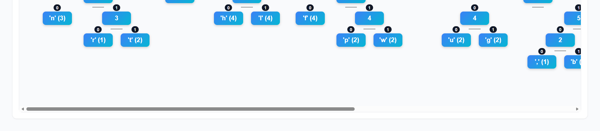

# Huffman Coding Visualizer

### Overview
The **Huffman Coding Visualizer** is an interactive React application that demonstrates how Huffman compression works. It allows users to enter or upload text, generates the corresponding Huffman codes, and visualizes the process through frequency tables, binary encoding, size comparison, and a live Huffman tree diagram with 0/1 edge labels.

### Features
- **Text & File Input** – Type text directly or upload a `.txt` file.
- **Frequency Table** – Displays each character with its frequency and Huffman code.
- **Binary Compression** – Converts the text into binary-encoded compressed output.
- **Size Comparison** – Compares original and compressed data sizes with compression ratio.
- **Huffman Tree Visualization** – Interactive tree with 0/1 edge labels for left/right branches.
- **Fully Client-Side** – No backend required; runs entirely in the browser.

### Tech Stack
- **Framework:** React (Vite-based setup)
- **Language:** JavaScript (ES6)
- **Visualization:** Pure React components (no external visualization libraries)
- **Styling:** Inline CSS with responsive layout

### File Structure
```
src/
  main.jsx                # React entry point
  App.jsx                 # Main component controlling logic & layout
  huffman/
    huffmanUtils.js       # Core Huffman algorithm (freq map, tree, encoding, stats)
    FrequencyTable.jsx    # Character frequency & code display
    CompressedOutput.jsx  # Displays compressed binary output
    SizeSummary.jsx       # Shows compression size and ratio
    HuffmanTreeView.jsx   # Renders tree with edge labels (0/1)
```

 
**Website:** https://daa-practicals.vercel.app/


## Preview



